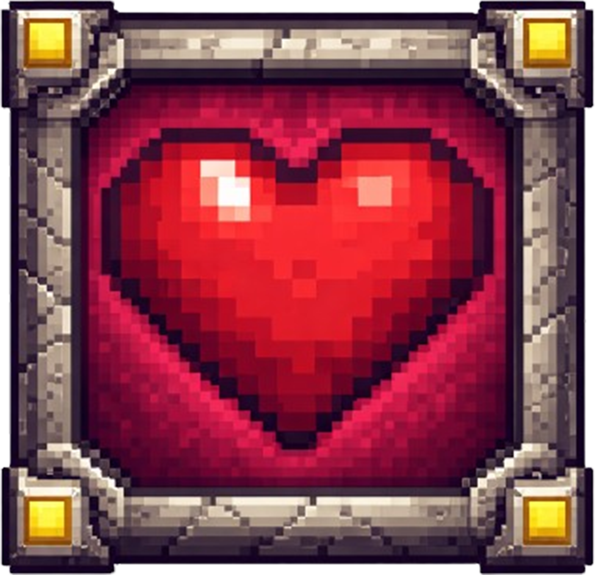
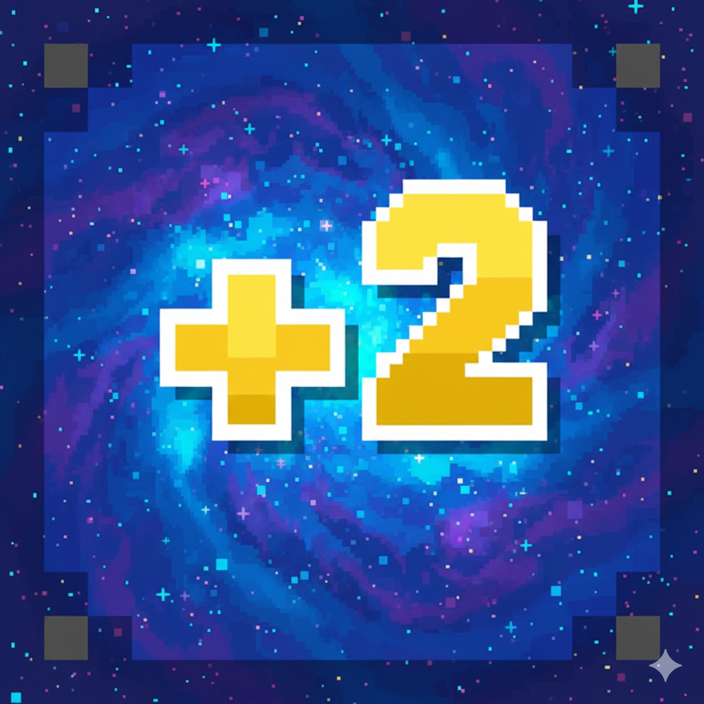
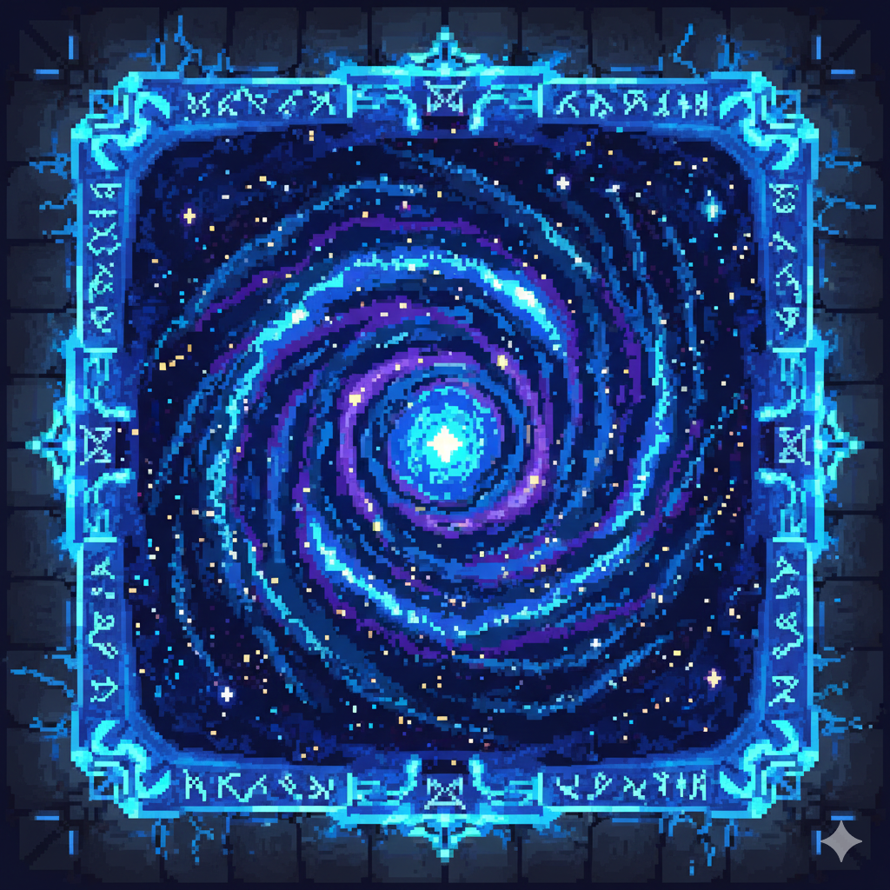
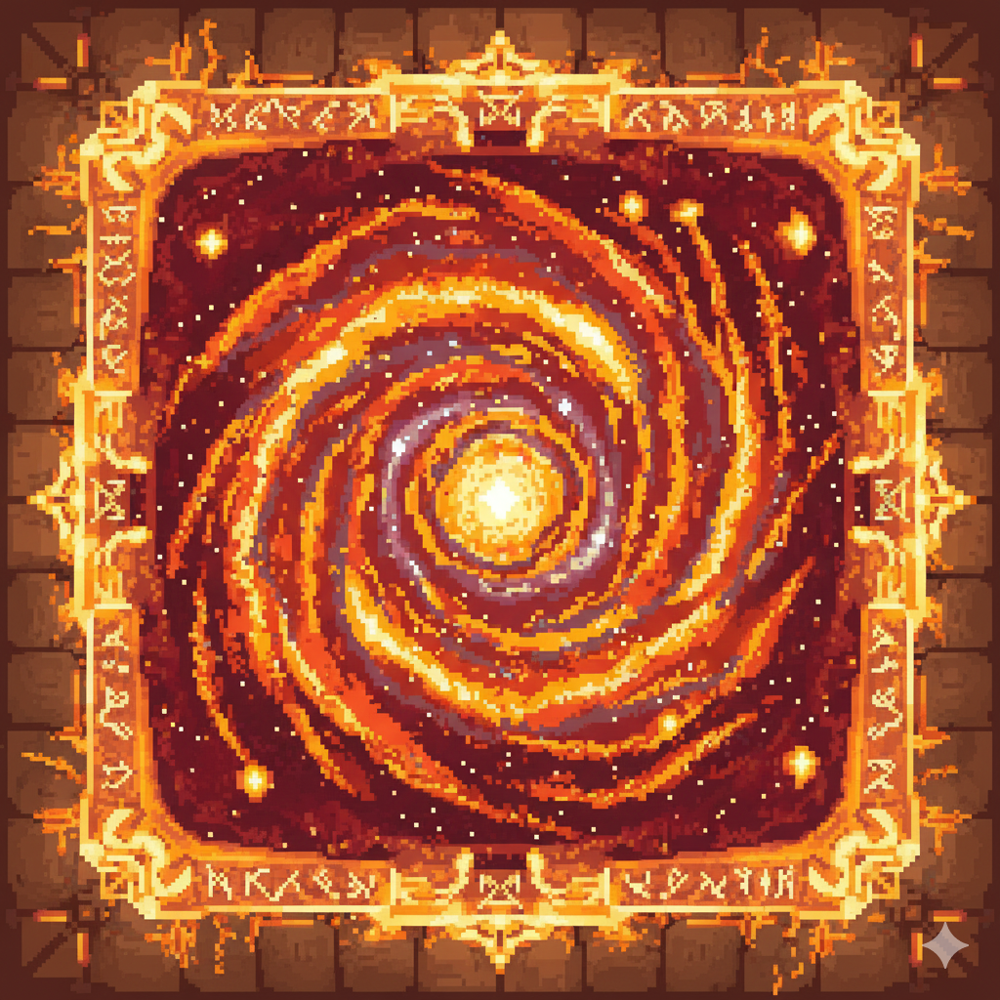

# 🚀 Breakout: In Space

A modern reimagining of the classic Breakout arcade game with a cosmic twist! Navigate through space-themed levels,
collect power-ups, and master portal mechanics in this fast-paced brick-breaking adventure.


## 🎮 Game Overview

**Breakout: In Space** is a space-themed arcade game where you control a UFO paddle to bounce a ball and destroy blocks
across 6 challenging levels. Each level introduces new mechanics and obstacles, culminating in an epic final boss level.

### 🌟 Theme

- **Setting:** Deep space with cosmic backgrounds
- **Visual Style:** Retro pixel art meets modern space aesthetics
- **Atmosphere:** Vibrant space stars, planets and galaxies

## ✨ Features

### Core Gameplay

- **Classic Breakout Mechanics** - Bounce the ball with your UFO paddle to destroy blocks
- **6 Progressive Levels** - Difficulty increases from tutorial to final boss
- **Multiple Balls System** - Support for up to 10 simultaneous balls on screen
- **3 Lives System** - Visual hearts display remaining lives

### 🎯 Power-Up Blocks

#### ❤️ Heart Block (H)

<div align="left">

</div>

- **Effect:** Grants +1 life
- **Cap:** Maximum 3 lives
- **Visual:** Red heart block
- **Sound:** Special heart pickup sound

#### ⚽ Multiball Block (M)

<div align="left">

</div>

- **Effect:** Spawns 2 additional balls
- **Mechanic:** New balls launch at 50° angles in opposite directions
- **Visual:** Yellow multiball block
- **Sound:** Ball spawn sound effect

#### 🌀 Portal System (A/B)

<div align="left">


</div>

- **Effect:** Teleportation between two portals
- **Mechanic:**
    - Enter Portal A → Exit from Portal B
    - Enter Portal B → Exit from Portal A
    - 0.3 second cooldown to prevent infinite loops
- **Visual:** Purple and blue portal textures
- **Sound:** 8-bit teleportation sound

### 🧱 Game Elements

- **Regular Blocks (@)**
- **Wall Blocks (#)**
- **Invisible Boundaries (!)**
- **UFO Paddle (P)**
- **Heart Block (H)**
- **Multi Ball Block (M)**
- **Portal1 (A)**
- **Portal2 (B)**

### 🎵 Audio System

- **Background Music** - Looping space-themed soundtrack
- **Sound Effects:**
    - Level completion
    - Life loss
    - Game over
    - Victory celebration
    - Heart pickup
    - Multiball spawn
    - Portal teleportation

### 🎨 Visual Effects

- **Animated Menus** - Floating text on main menu and victory screen
- **Victory Confetti** - 100 colorful confetti particles celebrating victory
- **Multiple Backgrounds** - 6+ unique space-themed backgrounds
- **Smooth Animations** - 60 FPS gameplay

### 🎮 Controls

| Key       | Action                        |
|-----------|-------------------------------|
| **←**     | Move paddle left              |
| **→**     | Move paddle right             |
| **E**     | Pause game                    |
| **Enter** | Start game / Resume / Restart |

### 📊 Level Design

#### Level 1: Tutorial 🟢

**Size:** 9x13 (compact)  
**Blocks:** 9 regular blocks  
**Power-ups:** None  
**Obstacles:** None  
**Layout:** Simple diamond formation in the center  
**Difficulty:** ⭐ (Very Easy)

#### Level 2: Hearts & Multiball 🟡

**Size:** 13x13 (medium)  
**Blocks:** 28 blocks  
**Power-ups:** 1 Heart (H), 1 Multiball (M)  
**Obstacles:** None  
**Layout:** Heart-shaped formation with power-ups at key positions  
**Difficulty:** ⭐⭐ (Easy)

#### Level 3: Portal Maze 🟠

**Size:** 13x13 (medium)  
**Blocks:** 24 blocks  
**Power-ups:** 2 Hearts (H), 2 Multiballs (M), 2 Portals (A/B)  
**Obstacles:** 4 Wall blocks forming a cross pattern  
**Layout:** Symmetrical cross pattern with walls dividing the field  
**Difficulty:** ⭐⭐⭐ (Medium)

#### Level 4: The Diamond Fortress 🔴

**Size:** 13x13 (medium)  
**Blocks:** 25 blocks  
**Power-ups:** 1 Heart (H), 2 Multiballs (M), 2 Portals (A/B)  
**Obstacles:** None  
**Layout:** Diamond/checkerboard pattern with strategic portal placement  
**Difficulty:** ⭐⭐⭐ (Medium-Hard)

#### Level 5: The Castle 🟣

**Size:** 17x16 (large)  
**Blocks:** 53 blocks  
**Power-ups:** 1 Heart (H), 5 Multiballs (M), 2 Portals (A/B)  
**Obstacles:** 4 Wall blocks protecting the heart  
**Layout:** Rectangular castle structure with protected core  
**Difficulty:** ⭐⭐⭐⭐ (Hard)

#### Level 6: The Final Challenge ⚫

**Size:** 15x15 (large)  
**Blocks:** 36 blocks  
**Power-ups:** 2 Hearts (H), 2 Multiballs (M), 2 Portals (A/B)  
**Obstacles:** 3 Wall blocks forming a vertical barrier  
**Layout:** Symmetrical mirrored design split by a wall  
**Difficulty:** ⭐⭐⭐⭐⭐ (Very Hard)

### 🏗️ Technical Features

- **Collision Detection:** Precise rectangle-based collision system
- **Physics:** Realistic ball bouncing with velocity management
- **State Machine:** Clean game state management (Menu, Playing, Paused, Victory, Game Over)
- **Architecture:** Separated concerns (ball, paddle, level, graphics, assets)

## 🛠️ Technology Stack

- **Language:** C++17
- **Graphics Library:** Raylib
- **Build System:** CMake/Make

## 📁 Project Structure

```
breakout/
├── breakout.cpp              
├── ball.cpp & ball.h         
├── paddle.cpp & paddle.h     
├── level.cpp & level.h       
├── graphics.cpp & graphics.h 
├── assets.cpp & assets.h     
├── sprite.cpp & sprite.h     
├── game.h                    
└── data/
    ├── fonts/
    │   └── LCDSolid1.13-Regular.TTF
    ├── images/
    │   ├── backgrounds/
    │   │   ├── menu_background.png
    │   │   ├── game_over_background.png
    │   │   ├── level_background.png
    │   │   ├── level2_background.png
    │   │   ├── level3_background.png
    │   │   ├── level4_background.png
    │   │   ├── level5_background.png
    │   │   └── level6_background.png
    │   ├── ball.png
    │   ├── paddle.png
    │   ├── block.png
    │   ├── wall.png
    │   ├── heart.png
    │   ├── heart_block.png
    │   ├── multi_ball.png
    │   ├── portal1.png
    │   └── portal2.png
    └── sounds/
        ├── song.mp3
        ├── win.wav
        ├── lose.wav
        ├── game_over.wav
        ├── victory.wav
        ├── heart.wav
        ├── new_balls.wav
        └── portal.wav
```

## 🏆 Victory Condition

Complete all 6 levels by destroying every destructible block. Watch the spectacular confetti celebration and restart to
challenge yourself again!

## 💀 Game Over Condition

Lose all 3 lives by letting balls fall off the bottom of the screen. You can retry the current level or return to the
main menu.

## 🎨 Art Style

- **Paddle:** Retro pixel art UFO/flying saucer
- **Ball:** Brown meteorite
- **Blocks:** Space metallic blocks
- **Backgrounds:** space pixel background images
- **UI:** LCD-style retro font (LCDSolid)

## 🔊 Sound Design

All sounds are carefully selected to match the space theme:

- 8-bit Sci-fi inspired sound effects
- Atmospheric background music
- Clear audio feedback for all actions

# 📦 Project Launch Instructions

## Quick Start (Pre-Built Version)

## Running from Source

### Requirements:

- A C++ compiler (g++, clang, or MSVC) installed
- Raylib installed
- CMake installed

### Steps:

1. **Clone the repository:**

```bash
git clone https://github.com/amantobae/simple-breakout-project
cd breakout-in-space
```

2. **Build the project:**

```bash
mkdir build
cd build
cmake ..
make # or mingw32-make on Windows
```

3. **Run the game:**

```bash
./breakout # Linux/macOS
# or
breakout.exe # Windows
```

## Running in an IDE (CLion, etc.)

1. Open the project folder in your IDE
2. Use built-in CMake support to build
3. Run the `breakout` target

## ⚡ Quick Start

If you already have all dependencies installed:

```bash
# 1. Clone
git clone https://github.com/amantobae/simple-breakout-project

# 2. Go to the folder
cd breakout-in-space

# 3. Build
mkdir build && cd build
cmake .. && make

# 4. Run
./breakout
```

## 🎮 Game Controls

## ❓ Help

If the game doesn't launch, make sure that:

- All files in the `data/` folder are present
- You have installed all the necessary libraries
- You are running the game from the correct directory

For questions, create an issue in the project repository!

## 📝 Credits

**Developer:** [Amantai Toktosunov]  
**Framework:** Raylib
**Font:** LCDSolid1.13-Regular  
**Inspiration:** Classic Breakout

**Enjoy breaking blocks in space! 🌌⚡🎮**